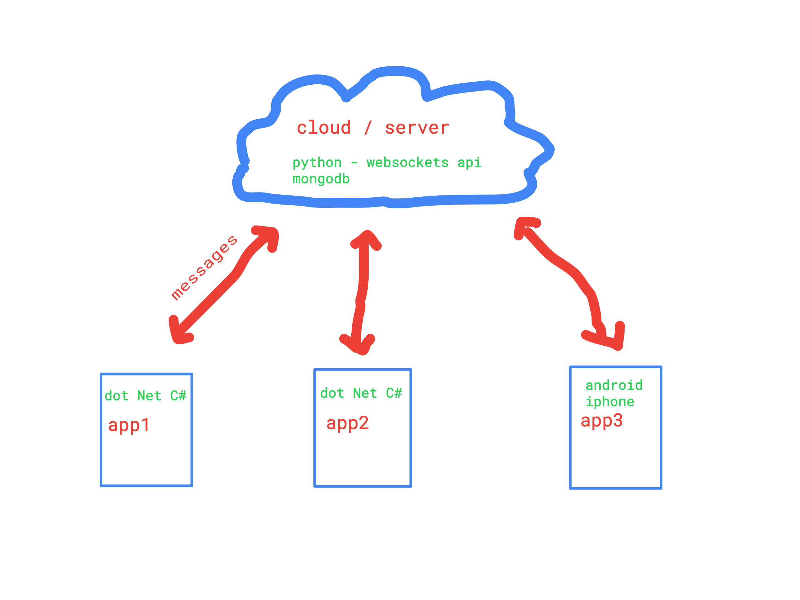
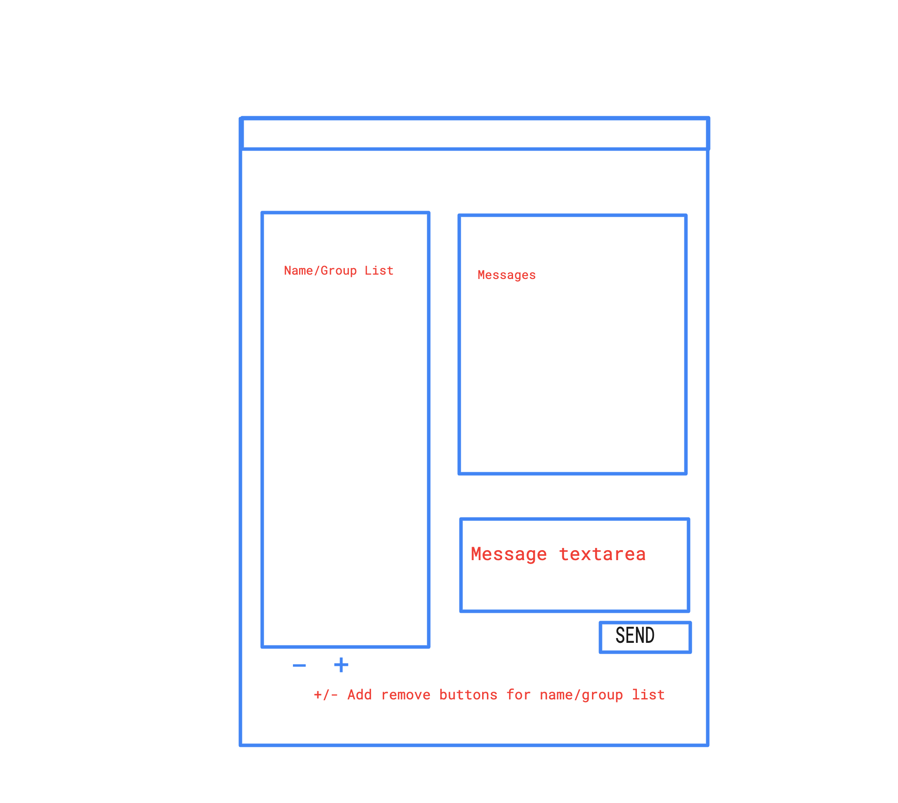

# snapmsgs

## Overall Concept

Quick demo of server in action
<video src="https://user-images.githubusercontent.com/4261471/168957828-ea522ad6-6405-40d4-b690-61bb4254f135.mov" controls="controls" style="max-width: 730px;">
</video>

Messaging app that will erase history of previous messages.  
Messages will not be stored in a database and will live on the server long enough to be sent to receiving apps

## UI Concept

UI will have a left user/group list when clicked on will display messages from that user/group  

On the right side will have the messages with a text area and button to send messages  

Below the user/group list, there will be two buttons to add or remove users/groups from the list

